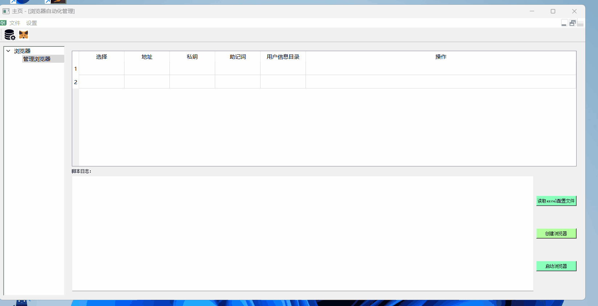
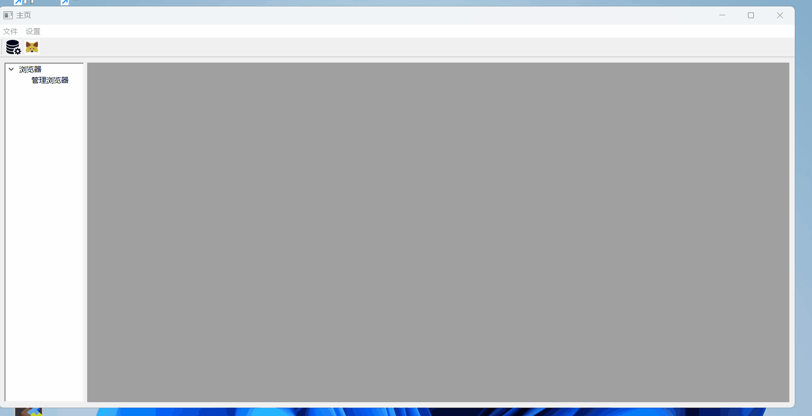

## 通用Python GUI工具界面

### 一、效果展示


### 二、功能描述
1、自定义菜单栏、工具栏功能

2、左侧操作树和右侧面板进行联动

3、方便快捷添加自己的操作界面

### 三、使用教程

1、使用QtDesigner设计窗口

使用qtdesigner设计窗口，并另存为.ui文件。

【注意】
你想要的界面效果可能qtdesigner无法百分比支持，这时你需要使用代码进行设计。

2、创建与ui文件同名的.py代码文件
同时创建同名.py文件。创建同名的主要目的是为了保持名称统一方便后期维护。

例如：browser_automate.ui的同名文件browser_automate.py

在该同名文件中进行ui初始化，事件绑定等步骤。

3、将窗口挂载到菜单栏或者挂载到左侧树节点

这里我将例如：browser_automate这个窗口挂载到了工具栏action_wallet的左侧树onWalletTree中即可。

### 四、启动

```
# 安装依赖
npm i

# 启动
python main.py

```